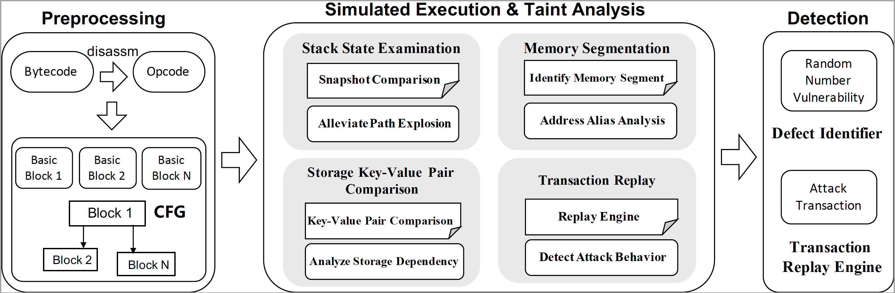

# RNVulDet

This repository houses a Python implementation of RNVulDet, a powerful tool designed to enhance the security analysis of smart contracts written in Solidity. RNVulDet integrates sophisticated taint analysis techniques to automatically identify and uncover vulnerabilities associated with random number generation. By leveraging advanced algorithms, RNVulDet scans Solidity or Bytecode input files to detect potential weaknesses in the random number generation process, thereby fortifying the resilience of blockchain applications against exploitation attempts.


## Overview
<div align=center></div>
*RNVulDet* comprises preprocessing and simulated execution. This Figure depicts the overall architecture of our proposed *RNVulDet*. In particular, RNVulDet engages in four main components to perform taint analysis, i.e., stack state examination, memory segmentation, storage key-value pair comparison, and transaction replay.

## Usage

```
python3 getData{x}.py
python3 main.py {BYTECODE_FILE} [-o {OUTPUT_FILE}]
```

## Dataset
Dataset\_1 contains 34 smart contracts reported to possess the random number bug.

Dataset\_2 includes a total of 214 smart contracts that do not have random number vulnerabilities.

Dataset\_3 consists of 4,617 potential victim contracts, 43,051 potential malicious contracts, and 49,951 suspicious transactions for experiments.

## Output
- Dataset_1 output
```solidity
"is_reported": true - Something noteworthy has been found in the smart contract and reported. Implies a potential vulnerability or issue related to random number usage.

"steps": 1 - Number of steps or operations the tool had to perform to reach its conclusion. A single step implies either a straightforward analysis or a very specific check.

"conditions": 3 - Number of related conditional statements or decision points within the smart contract being analyzed. In the context of randomness, these conditions may involve the use or validation of random numbers. More conditions imply more complex randomness-related logic.

"call_values": 0 - No cases of Ether or token transfer were found in the analyzed code. Relevant because transactions often interact with random number generators in smart contracts for gaming or gambling, where vulnerabilities could be exploited.

"to_addresses": 0 - No external smart contract addresses were called or interacted with in the analyzed code. This may be relevant in assessing the isolation of the random number generation process and susceptibility to external influence.

"todo_keys": 1 - At least one significant aspect or operation requires attention or further analysis. It may imply an undiscovered pathway in the code or a potential area where randomness-related vulnerabilities could exist.

```
- Dataset_2 output
```solidity
"is_reported": false - No significant issues or vulnerabilities related to random number usage were found by the tool in the smart contract.

"steps": 0 - The absence of any steps indicates that either the tool did not need to perform any operations to reach its analysis conclusion, or it did not find any relevant code to analyze. This may suggest that the smart contract does not use randomness in the way the tool is designed to analyze or consider.

"conditions": 0 - No randomness-related conditional logic was detected in the smart contract. This could mean either the contract does not use random numbers, or it uses them in a simple manner without complex conditions.

"call_values": 0 - Similar to the previous result, indicating no Ether or token transfers within the analyzed parts of the smart contract. This further supports the idea that randomness-related operations (if any) in the contract do not involve value transfers.

"to_addresses": 0 - No interactions with external smart contract addresses were found by the tool. This implies that the contract's functionality, in the context of randomness, is self-contained and not dependent on external sources.

"todo_keys": 0 - No aspects or operations are flagged for further investigation. This means the tool did not identify any areas within the smart contract that may require additional attention regarding random number usage.

```
